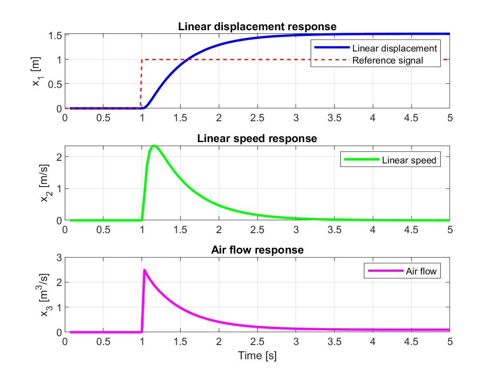
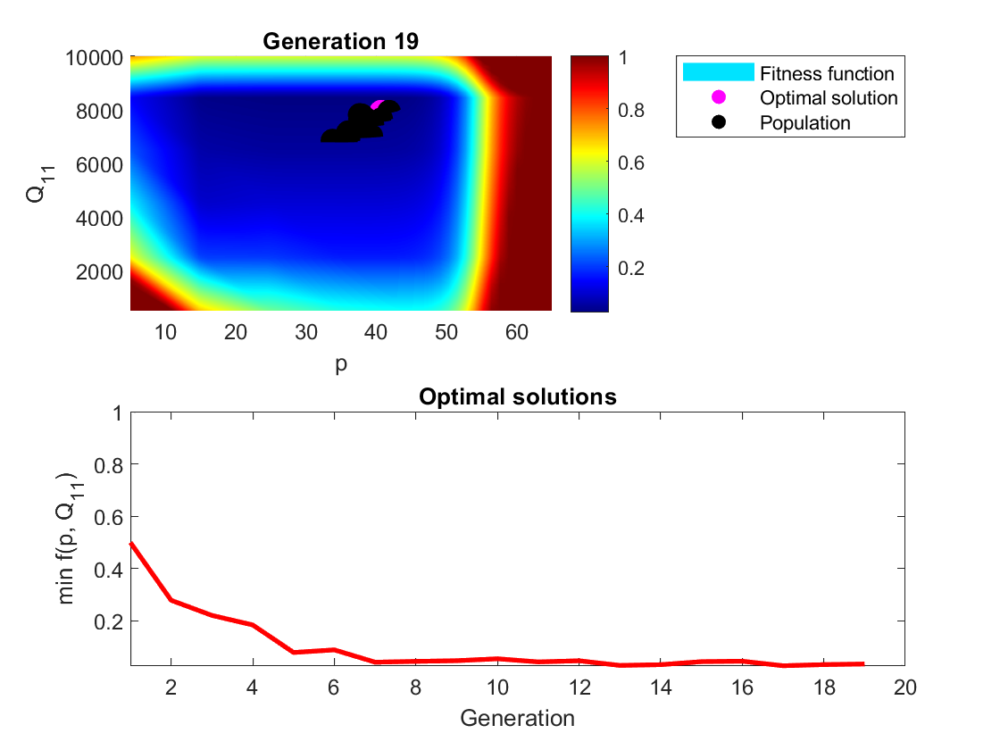
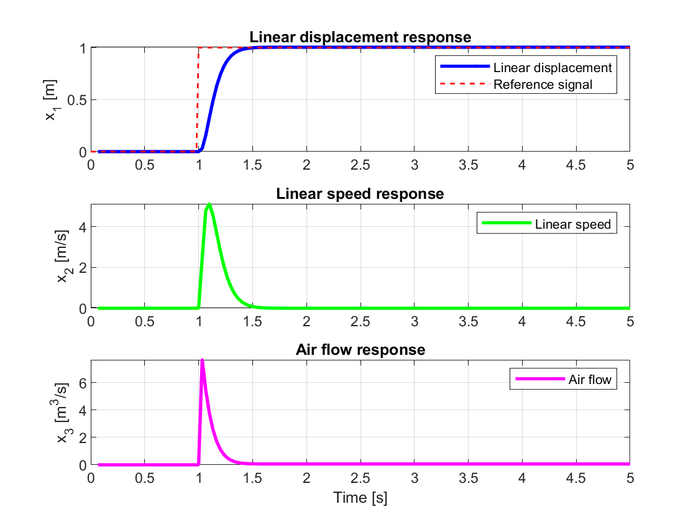

# MPC-optimization-using-a-Genetic-Algorithm

This project applies a Genetic Algorithm (GA) to optimize tuning parameters of a Model Predictive Controller (MPC) designed for a pneumatic artificial muscle actuator.

The optimization targets two key parameters:
- **Prediction horizon (p)** — affects controller anticipation and real-time feasibility
- **Cost matrix weight Q₁₁** — influences tracking aggressiveness

The fitness function balances reference tracking performance with rise time and control effort while penalizing impractical configurations (e.g., long prediction horizons).

> This project was developed independently as part of the *Application of AI* college course

Key Features:
- Custom Genetic Algorithm with:
  - Custom fitness function design based on steady-state error, rise time, and prediction horizon penalty
  - Tournament selection
  - Arithmetic crossover
  - Adaptive Gaussian mutation
  - Early termination on stagnation
- Full MPC model and simulation built in MATLAB
- Real-time visualization of convergence and fitness landscape

---

## Simulation and Optimization Results

Manually tuned MPC before optimization:

The GA evolves an optimal parameter set `(p = 35, Q₁₁ = 7915)` that minimizes tracking error and balances response smoothness:

- Optimization converged in **20 generations** (pre-determined max. number)
- Best solutions cluster near global fitness minimum
- Shows effective adaptation of mutation rate and convergence behavior

The optimized MPC demonstrates superior performance:

- Faster rise time  
- Reduced steady-state error  
- Smooth actuator behavior

---

## Tools Used

- MATLAB (pure script-based, no toolboxes)
- Custom-coded Genetic Algorithm
- Quadratic programming via `quadprog` for MPC

---

> Full project report available in [`/docs/final_report_GA_MPC_Leonard_Miksa.pdf`](docs/final_report_GA_MPC_Leonard_Miksa.pdf)

---

Author:
**Leonard Mikša**  
MSc Electrical Engineering student  
📧 [leonardmiksa@gmail.com](mailto:leonardmiksa@gmail.com)
